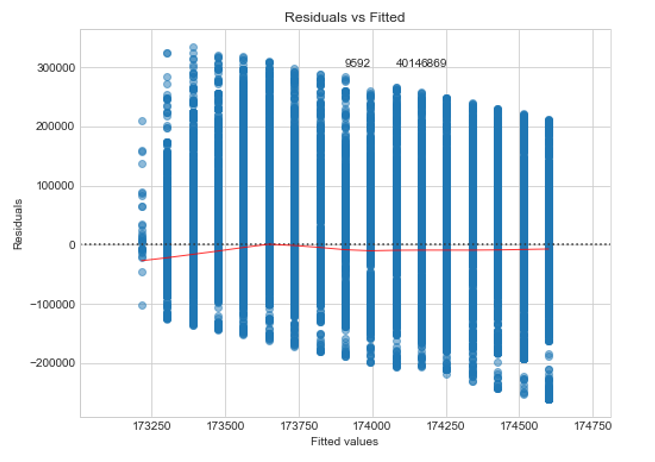

# Construction_Project_Cost
Estimate the cost of a project based on multiple attributes related to construction site
**Linear\_regression\_Construction\_data**

The following is an outline for a simple data analysis project.

Please download the
dataset [[https://s3.amazonaws.com/cc-analytics-datasets/Building\_Permits.csv]{.underline}](https://s3.amazonaws.com/cc-analytics-datasets/Building_Permits.csv).
The provided dataset comes from the City of Raleigh Open Data website
and is based upon pending/granted building permits.

Here are the following concepts I have worked on:

1.  Load the data from the provided source via a web request rather than
    downloading a local copy and loading from disk.

2.  Review the summary statistics for the included features. o Number of
    rows and columns in the dataset

    a.  Total different types of construction o Mean and median number
        of stories

    b.  Standard deviation for the X and Y coordinates of the permits

3.  Plot the distributions for each of the following features: Estimated
    Project Cost and Issue Date Month. Describe the distributions for
    these fields and explain what insights you might be able to gather.

4.  A hypothetical executive team is interested in the behavior between
    Permit Issue Year and Estimated Project Cost, but only for the
    \"New\" construction work class, with a construction type of \"V
    B\", and with less than 3 stories. Perform a simple regression
    analysis of this relationship and describe what insights we can
    gleam from this using success metrics. (Hint: Implement handling for
    missing values and explain your reasoning.)

5.  What additional techniques or methodologies could be used to improve
    the results from the previous step?

Exploratory Data Analysis
=========================

{width="4.8308792650918635in"
height="3.0982655293088364in"}

#### **Analysis from Graph **

This is a powerful plot which shows the **HOUSING BUBBLE RECESSION**.
The number of projects sanctioned were high during the years 2002 till
2007 and because of this the estimated project cost is also high.

Once the recession started we see a steep drop in the estimated project
costs cause there was no finance to create new buildings and on-going
constructions came to halt. After the end of recession (2009) the market
slowly started recovering (the upward curve).

The number of rows in this dataset are: 141953

The number of columns in this dataset are: 87

Total number of NA values in whole dataframe: 2107710

#### This dataset contains Astonishing NA values.

Right now my focus is to clear the NA values of the needed columns

#### There are 87 columns and it seems intimidating to have all these columns in just one dataframe.

So, I have divided the dataframe into multiple based on the names of
columns. We can merge them in future again to derive values or analysis.
The primary intention of this breakdown is to slowly get picture of all
these attributes

### Total different types of constructions 

The type of building seems new to me as I dont know what these roman
letters depict.

A quick google search revealed that these are **FIRE-RESISTANCE
RATING** 🔥

• Type I-- Commonly referred to as fire-resistive construction

• Type II-- Commonly referred to as non-combustible construction

• Type III-- Commonly referred to as ordinary construction

• Type IV -- Commonly referred to as heavy-timber construction

• Type V-- Commonly referred to as wood-frame construction

More information about this can be found
here <https://codes.iccsafe.org/public/document/code/542/9670120>

The number of buidings with construction type I - 4919 account for 3.47
percentage of total construction

The number of buidings with construction type II - 14002 account for
9.86 percentage of total construction

The number of buidings with construction type III - 2113 account for
1.49 percentage of total construction

The number of buidings with construction type IV - 2514 account for 1.77
percentage of total construction

The number of buidings with construction type V - 91734 account for
64.62 percentage of total construction

The number of buidings with construction type VI - 18809 account for
13.25 percentage of total construction

#### Analysis from Output 

The maximum number of constructions are grade five with 91734
houses/constructions, which account upto 65% of the construction type
(As type V typically contains the residential houses, it is accounting
for maximum share)

The least amount of contruction type is III with a mere 1.49
percent(there are very less ORDINARY Construction type in Raleigh area)

Interesting to see type VI construction type which I did not find in any
online article

There are 102271 buildings having one or two floors which account 57.0
percentage of total buildings

#### Analysis from Output 

All these numbers and graphs show that there is data issue for the
number of stories column. Cause the tallest building Burj Khalifa has
163 floors and our data shows 342,000 stories (This is a serious issue)

> 1.The highest number of floors in Raleigh city is 32 (PNC plaza)
>
> 2.The 25th and 75the percentile tells that more than 50% buildings
> contain either 1 or 2 floors, with a median of 2 floors
>
> 3.The mean value is 9.7. These metrics are not realistic as they are
> effected by outliers. The boxplot clearly shows the skewness because
> of the extreme points

#### Solution: Try to investigate why we have such unintended values in the number of stories column

### **Standard deviation for the X and Y coordinates of the permits **

The latitude of Raleigh is 35.787743 and the longitude is -78.6442.
Hence, the assumption is that there wont be much deviations or
variations in the data of X and Y column

{width="4.832369860017498in"
height="2.59998031496063in"}

Difference between maximum and minimum value of X co-ordinates is
0.3256715894193576

Difference between maximum and minimum value of Y co-ordinates is
2.014211497621062

#### **Analysis from Output **

More number of buildings are situated near -78.64 longitutde

With a Difference of 0.3256 between the minimum and maximum value of X
column, we can say that the variance is less. This intern implies that
the standard deviation will be very minute (std 0.0688)

**The standard deviation of X and Y show that the area operated is
higher in terms of north and south distance rather than east and west as
the variation in Y coordinates is higher than X coordinates**

{width="5.852822615923009in"
height="2.202311898512686in"}

#### Analysis from Output 

> 1\. The distribution plot shows that this column is highly skewed to
> right. Which means there are constructions
>
> that cost a lot more than others.
>
> 2\. 75 % of the projects costed between 1 to 135 thousand dollars, with a
> mean of 54 thousand dollars
>
> 3\. The minimum cost is 0 and maximum cost is whooping 170 million
> dollars.
>
> 4\. The quartiles of year show that there are more number of projects
> sanctioned during 2000 to 2008 than
>
> from 2008 to 2018

The bar plot shows the cumulative amount of estimated millions of
dollars spend in each month inrespective of year

> 1.The April month is the active construction month and december is the
> time when least productive work happen (cause it is christmas time)

### 193 rows have NA values which is less than 0.5 % of whole dataset.

So, we can either drop the rows or impute. I chose imputing

Out of 193 NA value rows, 66 NA values contain same year on the above
and below row.

#### I have replaced the NA values with an assumption that the NA is actually the value on its above row

example: If there is NA value on 25th index then the 26th index and 24th
index will have same issue year. There are 66 such matching indexes.

There are different ways to handle missing values:

> A constant value that has meaning within the domain, such as 0,
> distinct from all other values.
>
> A value from another randomly selected record.
>
> A mean, median or mode value for the column.
>
> A value estimated by another predictive model.
>
> {width="4.560693350831146in"
> height="4.105598206474191in"}**Linear Regression**

#### Analysis from Output 

##### *We see the Adj- R2 value is 0.055 which means there is just 5 % explainability of Estimated project cost from issue data year.*

Hence lets improve data by a bit and re-apply the regression

The above plot shows the regression line and can conclude that the line
seems horizontal as the Y axis range is soo huge that the line although
has positive slope we are unable to view. So removing outliers will make
it more clear

#### Outlier Removal:Removing the rows having estimated project cost value greater than Three Inter-Quartile Range

This is because the outlier skew linear regression equation and
increases the error.

Also in real world the frequency of outliers will be less when compared
with normal other data points

So removing outliers (high leverage points) is the best thing to have
a **generalized model**

{width="4.161849300087489in"
height="2.651399825021872in"}

### **Analysis from Output **

It is surprising to see that the column estimated project cost has 88%
explainablity by issuedate\_yr (the adjusted R-square). Although Adj-R2
is high we should not rely on it. Let\'s check the errors model made on
train and test dataset

**With every increase in year the estimated project cost increases by
56.55 \$**. This means the estimated project cost rate is 56.55 per year
and keeps positively progressing every year

The p-value:0 shows that the column issuedate\_yr is important and has
weightage in predicting the estimated project cost.

The confidence interval shows that the estimated project cost can
increase in between 56.237 and 56.830 \$

#### **Model Error**

The mean square error on training dataset is 1659425361. which is very
high. We would expect the error. The concluion is that the model did not
fit well with the values and cannot be deployed. As the model did not
perform well on trainig dataset. It is bound to have high testing error
i.e 1712748110.

### The model is created in an assumption that the data obeys three important simple linear properties:

> 1\. There is a linear relationship between independent and dependent
> variables
>
> 2\. The errors follow a normal distribution
>
> 3\. Data is homoscedastic (it follows equality of variance)

Let\'s see how well is the data validating these assumptions

### **Assumption: Relationship between independent and dependent variables**

> {width="3.9595374015748033in"
> height="2.291116579177603in"}

### **Analysis from graph **

From the above scattered plot I conclude that the data is not acceptable
as linear. So we rule out the first assumption: there is a linear
relationship between independent and dependent variable

### 

### **Assumption: Errors follow a normal distribution**

{width="3.640429790026247in"
height="2.7225437445319334in"}

### **Analysis from Output **

The plot shows that the errors are not normally distributed (by looking
at the curve extremes

### **Assumption: Residuals have Equality of Variance [¶](http://localhost:8888/notebooks/Linear_regression_Construction/Regression_construction_data.ipynb#Assumption:-Residuals-have-Equality-of-Variance-)**

{width="3.560693350831146in"
height="2.611175634295713in"}

### **Analysis from Output **

### As we have many data points the residuals vs fitted is very broad and the errors are not normally distributed. The assumption of equal variance can also be rejected.

FINAL ANALYSIS
==============

**With every increase in year the estimated project cost increases by
56.55 \$**

> The column issueddate\_yr is important in predicting the
> estprojectcost. Although, the estprojcost is directly proportinal
> (positively related) to issueddate\_yr (which means development &
> progress). It is not enough to rely on its predictions

From the error metrics I conclude that **this model cannot be used to
predict estprojectcost with least error** (Maybe by combining other
features a roboust one can be created)

{width="5.485416666666667in"
height="3.047222222222222in"}
